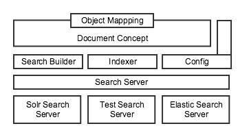

## 1. Introduction

This repository contains the modular Redbull Media House Technology *Vind* for java. 
The lib was build to enable the integration of search facilities in several projects without getting too deep into the 
search topic. It should help programmers to come to a good solution in an assessable amount of time, improve the 
maintainability of software projects, and simplify a centralized search service management including monitoring and reporting.
 
The work tried to consider the following design issues:

**1. Versatility:** Vind will be used in many different projects, so it was an aim to keeping the dependency footprint small, 
which avoids version-clashes in the downstream projects.

**2. Backend Agnostic:** Wherever possible and feasible, the library has to be abstracted from the basic search framework. This enables the users to change the
backend without migrating application software.

**3. Flat learning curve:** It was an aim to keep the learning curve rather flat, so we tried to use Java built-in constructs whenever possible. Additionally
we tried to follow the concept: easy things should be easy, complex things can (but does not have to) be complex.

The search lib is modular and implements the following layers:

We built a short tutorial to give you a smooth entry to all the functions of the search lib.
The runnable code for each step can be found under `demo/demo-step{number}`.

For a deeper dive in the API of VIND [have a look at the Javadoc](https://rbmhtechnology.github.io/vind/javadoc/).

